**Shared Secret Configuration**

Vagrant WS:

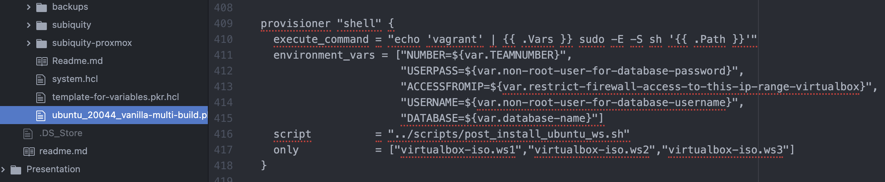

Vagrant DB:

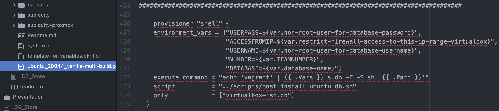

Proxmox WS:

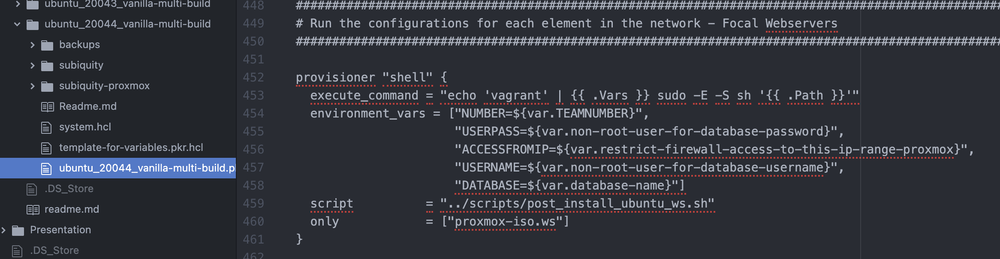

Proxmox DB:

Variables.pkr.hcl:

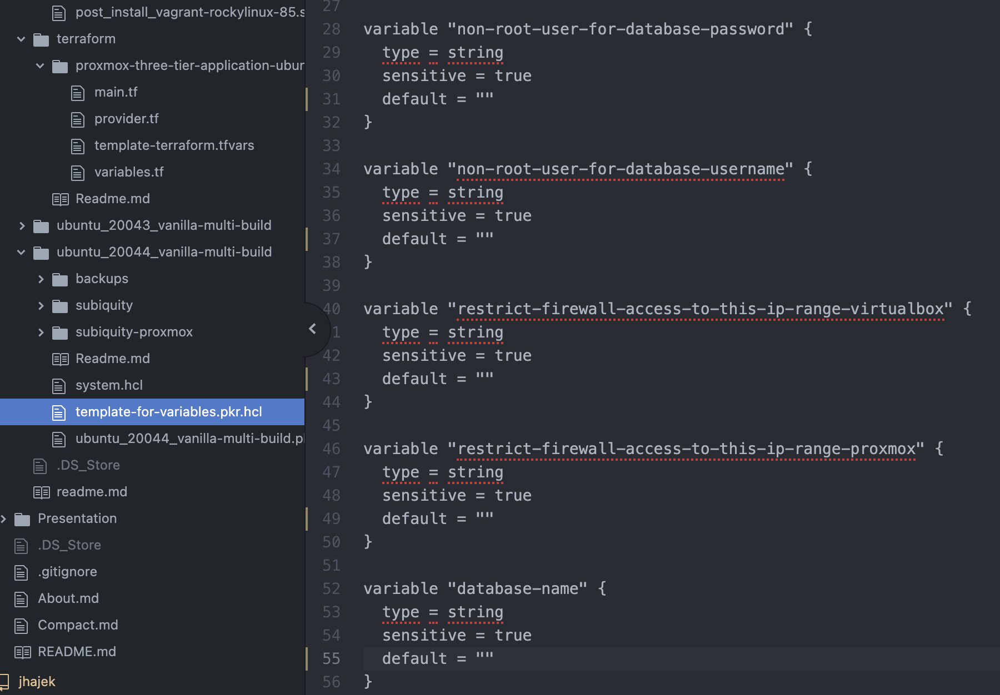

WS Database secrets:

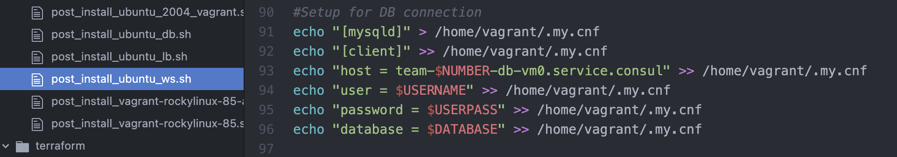

DB Database secrets:

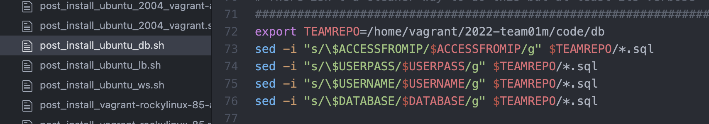

**Firewall**

WS Firewall:

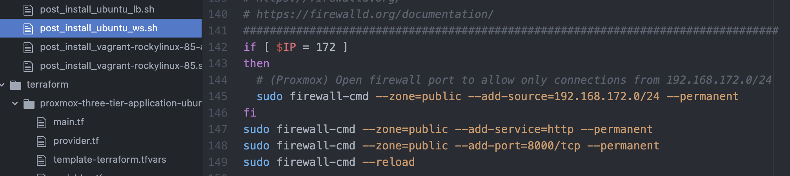

LB Firewall:

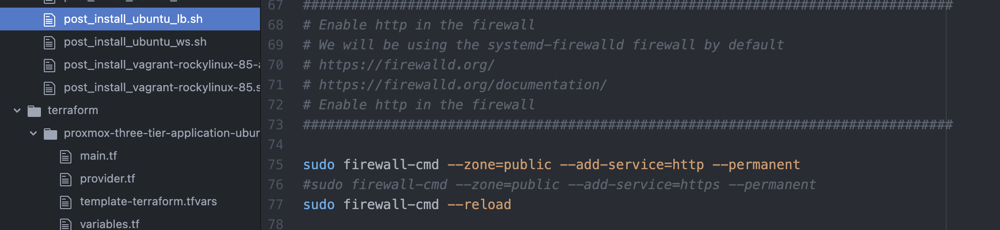

DB Firewall:

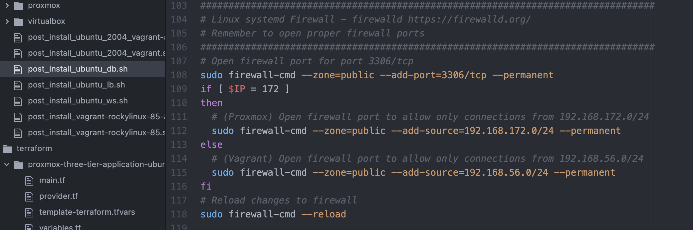

**Database Security**

MariaDB Security:

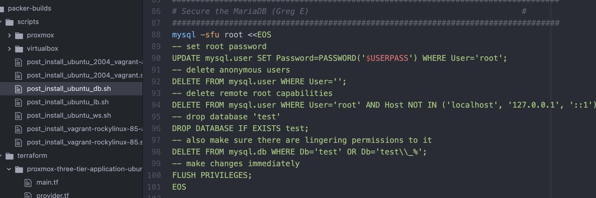

**Fail2Ban**

WS Fail2Ban:

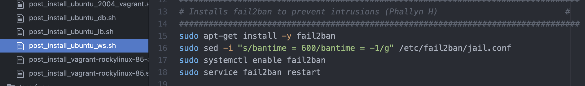

DB Fail2Ban

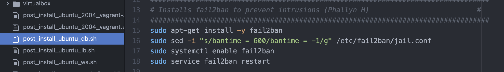

LB Fail2Ban:

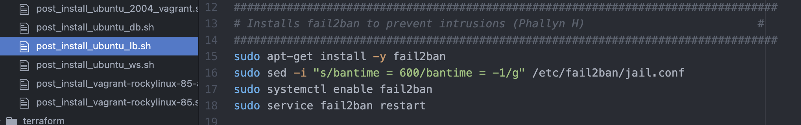

**NGINX Security**

Nginx.conf:

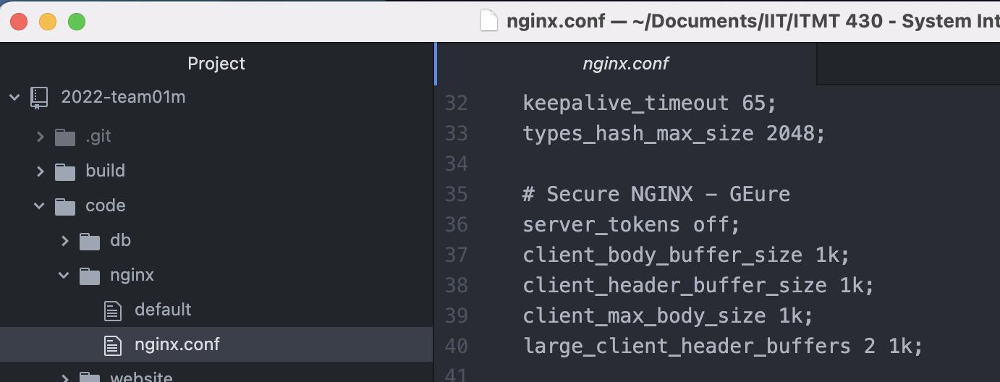

Default.conf:

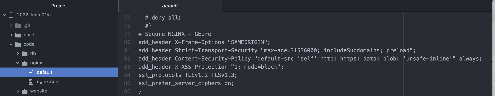

**NGINX HTTPS**

Nginx.conf:

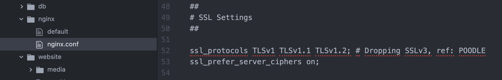

Default.conf:

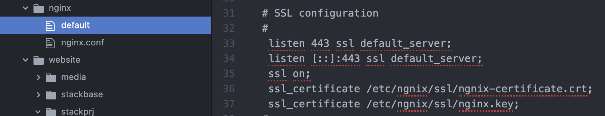

Firewall (allowing HTTPS):

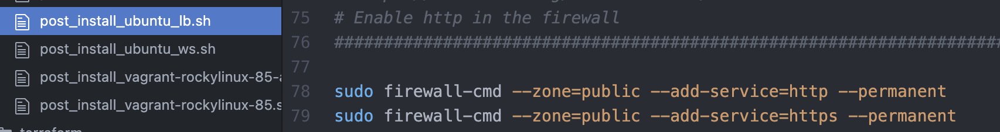

**Django Security**

Settings.py:

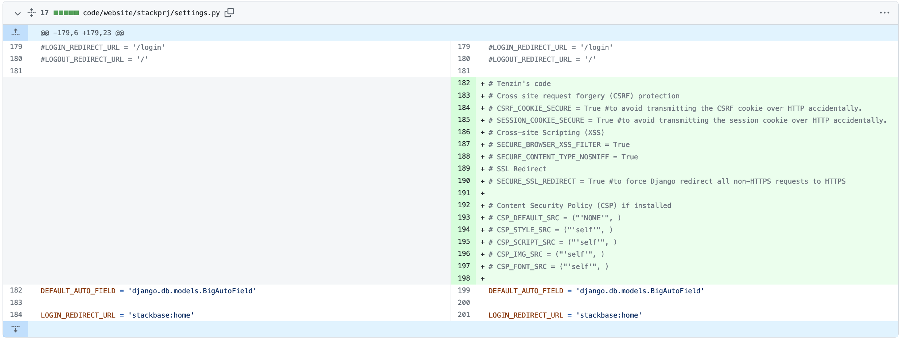
