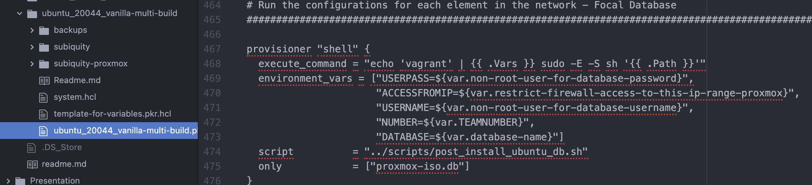

**Shared Secret Configuration**

Vagrant WS:

Vagrant DB:

Proxmox WS:

Proxmox DB:

Variables.pkr.hcl:

WS Database secrets:

DB Database secrets:

**Firewall**

WS Firewall:

LB Firewall:

DB Firewall:

**Database Security**

MariaDB Security:

**Fail2Ban**

WS Fail2Ban:

DB Fail2Ban

LB Fail2Ban:

**NGINX Security**

Nginx.conf:

Default.conf:

**NGINX HTTPS**

Nginx.conf:

Default.conf:

Firewall (allowing HTTPS):

**Django Security**

Settings.py:

